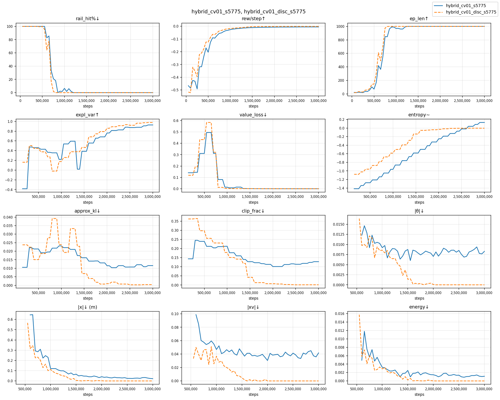
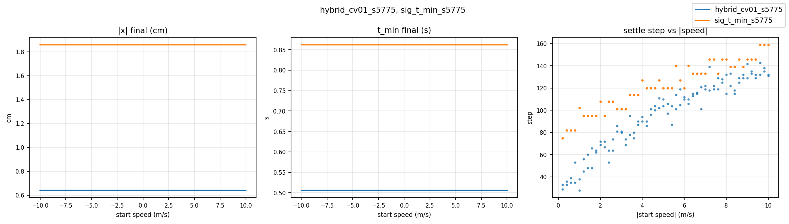
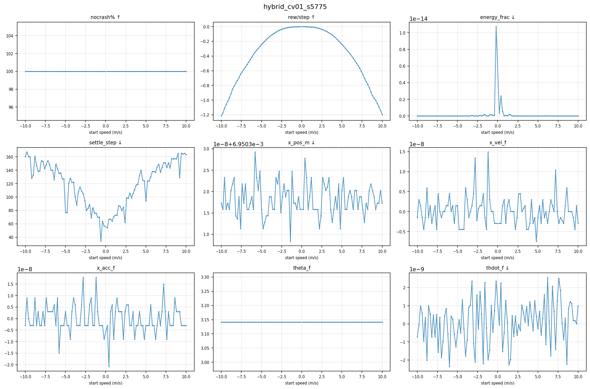
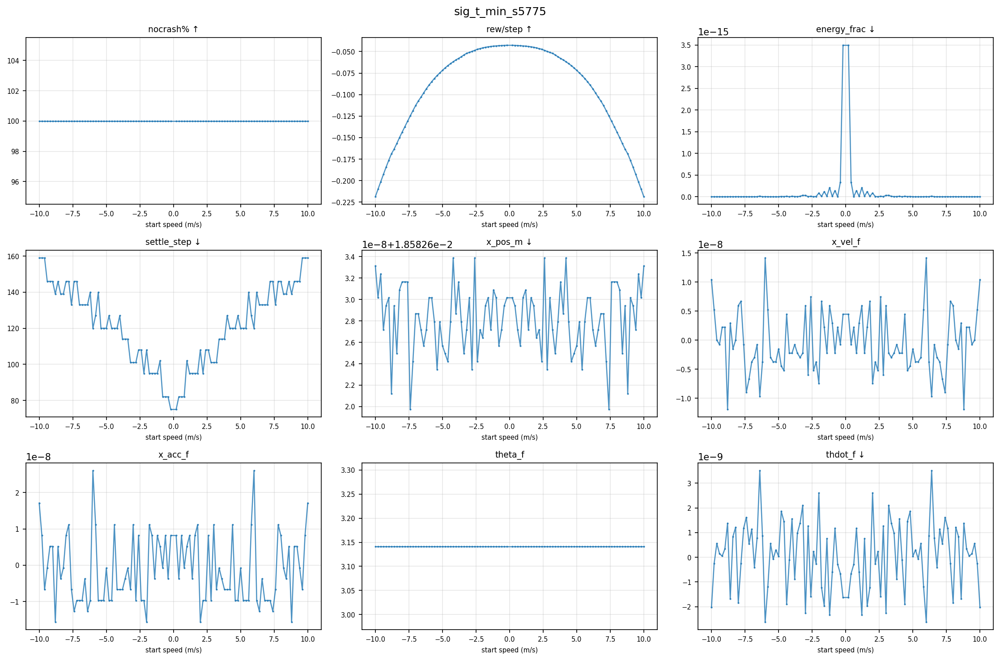
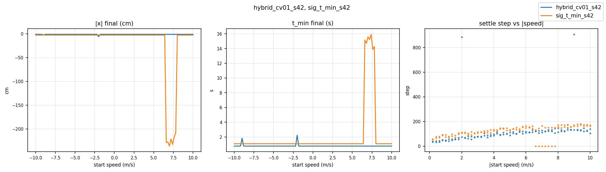
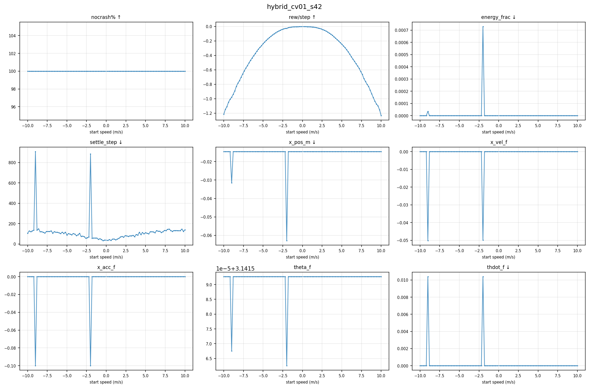
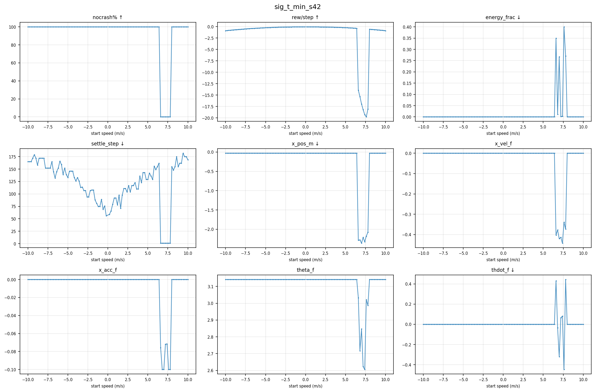

# Reward Design Comparison: `hybrid_cv01` vs `sig_t_min`

**Scope**: seeds 5775 and 42 · 3 000 000 training steps each · PPO (Stable-Baselines3)

Two reward formulations were trained on the same anti-pendulum crane environment with
identical PPO hyperparameters and the same random seed.  This document compares their
training dynamics, evaluation performance, and engineering trade-offs.

---

## 1  The two reward designs

**`hybrid_cv01`** (engineering-specified reward)

The agent receives a dense signal at every step composed of several explicit penalty terms:
position offset from centre, crane velocity, crane acceleration, and total mechanical energy.
Each term has a hand-tuned weight.  The agent is told *what to achieve* (stop here, stop
gently, use little energy) directly.

$$r_t^{\mathrm{hyb}} = \underbrace{-\!\left(g\,z_\mathrm{load} + \tfrac{1}{2}v_\mathrm{load}^2\right)}_{\text{pendulum energy}} - 0.1\,|x| - 0.1\,\dot{x}^2 + \delta_\mathrm{crash}\cdot(-5)$$

The *pendulum energy* term is the negative total mechanical energy of the load: most positive
(least negative) when the pendulum hangs stationary, decreasing as it swings.  The $-|x|$
and $-\dot{x}^2$ terms penalise crane offset and crane speed directly.  The $-5$ terminal
penalty fires once on rail collision.

**`sig_t_min`** (physics-derived reward, Sig's design)

The agent receives a single reward signal derived from the *time-optimal bang-bang stopping
distance*: given the crane's current position and velocity, how long would it take to reach
the centre under maximum acceleration?  This quantity — denoted $t_\text{min}$ — encodes
position and velocity jointly in a physically meaningful way.  The agent is told *how far it
is from optimality* rather than what each state variable should be.

$$r_t^{\mathrm{sig}} = \underbrace{-\!\left(g\,z_\mathrm{load} + \tfrac{1}{2}v_\mathrm{load}^2\right)}_{\text{pendulum energy}} - 0.05\,t_\mathrm{min}(x,\,\dot{x}) + \delta_\mathrm{crash}\cdot(-5)$$

The two explicit crane penalties are replaced by the single physics-derived $t_\mathrm{min}$
term.  Its closed-form expression follows from the bang-bang optimal control solution,
with three cases depending on whether the crane is moving toward or away from the origin
and whether it will overshoot:

$$t_\mathrm{min}(x_0, v_0) = \begin{cases}
\dfrac{|v_0| + 2\sqrt{|x_0|\,a + \tfrac{1}{2}v_0^2}}{a}
  & \operatorname{sign}(x_0) = \operatorname{sign}(v_0)\quad\text{(moving away)} \\[8pt]
\dfrac{-|v_0| + 2\sqrt{|x_0|\,a + \tfrac{1}{2}v_0^2}}{a}
  & |x_0| \geq \dfrac{v_0^2}{2a}\quad\text{(toward, no overshoot)} \\[8pt]
\dfrac{|v_0| + 2\sqrt{|x_0|\,a - \tfrac{1}{2}v_0^2}}{a}
  & \text{otherwise}\quad\text{(toward, overshoot)}
\end{cases}$$

where $a = 0.1$ m/s² is the maximum crane acceleration.

*Notation used above: $x$ = crane position (m), $\dot{x}$ = crane velocity (m/s),
$z_\mathrm{load}$ = vertical coordinate of the pendulum bob with $g = 9.81$ m/s²,
$v_\mathrm{load}$ = load speed (m/s).  The pendulum energy term is identical in both
configs.*

---

## 2  Metric glossary

### 2.1  PPO algorithm metrics

These quantities are produced by the PPO optimiser at each update step.  They describe how
the *learning process itself* is behaving, not the crane directly.

`explained_variance`
: The value function (critic network) continuously predicts the total future reward from the
  current state.  Explained variance measures how accurate those predictions are.
  Think of it like the innovation in a Kalman filter: a value of **1.0** means perfect
  predictions; **0.0** means the critic is no better than always guessing the average;
  **negative** means the critic is actively worse than guessing — it is confident but wrong.
  Healthy range once the agent is past the crash-avoidance phase: **0.5 – 0.9**.

`value_loss`
: The mean-squared error between the critic's predictions and the actual observed returns.
  Lower is better.  Healthy behaviour: starts high, falls monotonically, converges near zero.
  *Trap*: a very low value_loss coexisting with negative explained_variance signals that
  the critic has collapsed to predicting a near-constant for all states (zero variance in
  predictions → low MSE, but zero predictive power).

`approx_kl`
: KL divergence between the old policy and the updated policy after one optimisation step.
  Measures how much the agent's decision-making changed this update.  Healthy: small and
  stable (0.01 – 0.05).  Large values indicate an aggressive or destabilising update.

`clip_fraction`
: PPO limits how large each policy update can be via a clipping ratio.  This metric is the
  fraction of training samples that hit that limiter — analogous to a saturation nonlinearity
  in a controller.  Healthy: 0.10 – 0.25.  Consistently above 0.35 suggests the optimiser
  is fighting against the clip and update quality may degrade.

`entropy_loss`
: Stable-Baselines3 logs $-\text{entropy}$ of the policy distribution.  More negative =
  more random / exploratory.  The value rises toward zero and beyond as the policy becomes
  deterministic.  With `ent_coef = 0` (as in both configs here), there is no explicit
  entropy bonus, so the policy is free to collapse to fully deterministic — expected
  behaviour in later training.

`policy_gradient_loss`
: The PPO surrogate objective value.  Negative means the gradient is pointing in a
  direction that increases expected reward.  Should remain stable and negative.

### 2.2  Training performance metrics

`ep_len_mean`
: Average episode length (simulation steps).  The episode ends when the crane hits the rail
  (crash) or reaches `max_episode_steps`.  Healthy: grows from ~20 (constant crashing) to
  the configured maximum (1 000 for `hybrid_cv01`, 1 500 for `sig_t_min`).

`rew_per_step`
: Total episode reward divided by episode length — a normalised reward signal that removes
  the confounding effect of episode length changing over training.  Healthy: increases
  (becomes less negative) over time.

`rail_hit_pct`
: Percentage of episodes that ended by the crane hitting the rail.  Healthy: starts at 100%
  (random policy crashes immediately), falls to 0% and stays there.

### 2.3  Physical crane metrics

These appear in the log only once some episodes survive without crashing.  They measure what
the crane actually does at episode end, independent of the reward formulation.

`mean_t_min`
: Mean time-optimal stopping distance across logged episodes (seconds).  Lower means the
  crane is closer to the centre and/or moving more slowly.  Sub-0.5 s is good; sub-0.1 s
  is exceptional.

`mean_x_pos_abs`
: Mean absolute crane position from centre (metres).  Falls toward 0 as training progresses.

`mean_x_vel_abs`
: Mean absolute crane velocity (m/s).  Falls toward 0 as the crane learns to stop cleanly.

`mean_energy`
: Residual mechanical energy in the crane–pendulum system at episode end.  Falls toward 0
  as motion ceases.

`mean_theta_dot_abs`
: Mean absolute pendulum angular velocity (rad/s).  Falls toward 0 as the pendulum damps
  out.

`mean_theta_dev`
: Mean angular deviation of the pendulum from the upright position.  Falls toward 0 as the
  pendulum stays balanced.

---

## 3  Training story — seed 5775

*Figure 1. Twelve training metrics over 3M steps. Blue: hybrid_cv01_s5775.
Orange: sig_t_min_s5775. Key panels: rail_hit%↓ (top-left), expl_var↑ (row 2 col 1),
value_loss↓ (row 2 col 2), |x|↓ (bottom row).*

### 3.1  Summary

| Event | `hybrid_cv01` | `sig_t_min` |
|---|---|---|
| rail_hit → 0% (permanent) | **850 k steps** | ~2.1 M steps |
| ep_len hits maximum | 1.2 M (cap = 1 000) | 1.8 M (cap = 1 500) |
| Value function instability events | 1 minor (1.35 M: EV → 0.019) | 2 significant (1.85 M: −0.12; 2.1 M: −0.18) |
| Explained variance at 3 M | **0.93** | 0.46 |
| Value loss at 3 M | 5.2 × 10⁻⁵ | 5.5 × 10⁻⁴ |
| Mean \|x\| at 3 M (training log) | 0.022 m | 0.024 m |

### 3.2  Phase 1 — Survival (0 – 700 k steps)

Both configs start with a random policy.  The crane hits the rail within roughly 20 steps
every episode.  Episode length grows slowly as the agent learns to delay the inevitable
crash.  Physical metrics are not meaningful here because all episodes end in crashes.

### 3.3  Phase 2 — Crash elimination

`hybrid_cv01` eliminates crashes decisively: rail_hit_pct falls from 100% to 0% by
**850 k steps** and never returns.  The explicit position-penalty terms give the agent a
direct incentive to stay away from the rail at every step.

`sig_t_min` takes far longer.  Crash rates bounce between 5% and 10% across the 1.0–1.35 M
step range, with only brief dips to 0%.  The agent must infer from the $t_\text{min}$
signal alone that being near the rail is bad (high $t_\text{min}$, heavily penalised through
energy cost).  This is a weaker and more indirect signal, and rail-avoidance is learned
later — permanent 0% is not achieved until roughly 2.1 M steps.

### 3.4  Phase 3 — Value function events

When episode length first reaches `max_episode_steps`, the statistics of the reward signal
seen by the critic change suddenly: instead of a mix of short crash-terminated episodes and
longer ones, all episodes are now exactly the same length with small, steady negative rewards.
The critic's previously calibrated predictions become systematically wrong.

This triggers what is visible in the `expl_var` panel as a sharp downward spike.  Two
things happen simultaneously: explained_variance goes negative (the critic is now
*confidently wrong*) and value_loss paradoxically drops (the critic has collapsed to
predicting a near-constant value for all states — low MSE, but zero useful information
content).

**`hybrid_cv01`**: one minor event at 1.35 M (EV → 0.019).  The critic recovers within
~130 k steps and then climbs monotonically to **EV = 0.93** by 3 M.

**`sig_t_min`**: two significant events — at 1.85 M (EV → −0.12) and again at 2.1 M
(EV → −0.18).  Both are triggered by the same mechanism (ep_len hitting 1 500), the second
likely compounded by the partial recovery from the first.  EV never climbs above 0.60 again
and plateaus around 0.45–0.55 for the final 1 M steps, ending at **EV = 0.46**.

The difference in severity reflects the difference in problem difficulty.  `hybrid_cv01`'s
dense reward signal constrains the value landscape more tightly, making the critic's job
easier.  `sig_t_min`'s single aggregate signal leaves more ambiguity — the critic must
infer position and velocity separately from a scalar that combines them, leading to a less
precise and more fragile value function.

### 3.5  Phase 4 — Convergence (1.5 M → 3 M)

`hybrid_cv01`: explained_variance climbs 0.39 → 0.93 monotonically.  Policy becomes
increasingly deterministic (entropy_loss −0.58 → +0.13).  Mean |x| in the training log
falls from 0.066 m to 0.022 m.  Value loss reaches 5 × 10⁻⁵ — the critic is precisely
calibrated.

`sig_t_min`: EV oscillates between 0.45 and 0.60 for the entire final 1.5 M steps.  Policy
also converges, but from a weaker value function.  Mean |x| falls from 0.054 m to 0.024 m
(close to `hybrid_cv01` in the training log) but the training-log value reflects averages
over random starting speeds and does not predict the evaluation sweep result directly.

**Why does a higher EV matter?**  The actor network (policy) is updated using gradients
derived partly from the critic's value estimates.  A poorly calibrated critic introduces
noise into those gradients.  `hybrid_cv01`'s EV = 0.93 means ~93% of the return variance
is explained — each policy update is based on a nearly unbiased signal.  `sig_t_min`'s
EV = 0.46 means roughly half the return variance is unaccounted for — updates are noisier,
convergence is slower and less precise.

---

## 4  Speed sweep evaluation — seed 5775

Each trained model was evaluated at 100 initial crane speeds uniformly spaced from −10.0
to +10.0 m/s (step 0.2 m/s) with the pendulum initially at rest upright.  No randomised
start.  Each episode runs for the full episode budget (1 000 or 1 500 steps).

*Figure 2. Speed sweep across ±10 m/s. Left: final crane position (cm).
Centre: final t_min (s). Right: settle step vs |initial speed| (m/s).*

### 4.1  Summary

| Metric | `hybrid_cv01` | `sig_t_min` |
|---|---|---|
| Crash-free across all 100 speeds | **100%** | **100%** |
| Final position | **0.64 cm** | 1.86 cm |
| Final $t_\text{min}$ | **0.506 s** | 0.862 s |
| Settle step range | 29 – 143 steps | 75 – 159 steps |

### 4.2  Robustness across the speed range

Both controllers are **100% crash-free** across the full ±10 m/s range tested.  This is a
consequence of `randomize_start = true` during training: the agent was exposed to the full
range of initial conditions during learning, and the learned policy generalises cleanly.

Crucially, the final crane position and $t_\text{min}$ are **essentially constant across
all 100 speed points** (flat curves in Figure 2, left and centre panels).  The agent always
converges to the same physical attractor regardless of how fast the crane was initially
moving.  This is a strong deployment property: performance is predictable regardless of
operating condition.

### 4.3  Final precision

`hybrid_cv01` converges to a tighter attractor: 0.64 cm vs 1.86 cm (approximately 3×
better position, 40% better $t_\text{min}$).  The explicit position penalty during training
biases the learned policy toward parking the crane precisely at $x = 0$.  `sig_t_min` also
parks the crane near zero, but the indirect nature of the $t_\text{min}$ signal allows a
slightly looser attractor — once $t_\text{min}$ drops below the reward threshold, there is
no direct incentive to improve further.

### 4.4  Settle step and speed

The right panel of Figure 2 shows that settle step rises roughly linearly with |initial
speed|.  This is physically expected: higher initial momentum requires more braking time.
`hybrid_cv01` settles in 20–50 fewer steps across the entire range.

### 4.5  Detailed sweep metrics — individual models

The figures below show the full nine-metric breakdown for each model separately.
In addition to position and $t_\text{min}$, these panels show energy dissipation
efficiency, pendulum state at episode end, and crane velocity and acceleration residuals —
all of which confirm that both controllers achieve a stable, near-zero physical state
across the full speed range.

*Figure 3. `hybrid_cv01_s5775` — nine sweep metrics across ±10 m/s.
Top row: crash rate, reward per step, energy fraction (energy remaining relative to
initial kinetic energy). Middle row: settle step, final crane position, final crane
velocity. Bottom row: final crane acceleration, pendulum angle, pendulum angular velocity.*

*Figure 4. `sig_t_min_s5775` — same nine metrics. Note the higher energy fraction
and position residuals compared to Figure 3, consistent with the looser attractor
discussed in §4.3.*

---

## 5  Seed sensitivity — s42

The sweep was repeated with seed 42 to probe how sensitive each reward formulation is
to the specific training trajectory.

*Figure 5. Speed sweep across ±10 m/s — seed 42.  Same layout as Figure 2.
Note the crash band visible in the sig_t_min centre panel.*

### 5.1  hybrid_cv01 — seed 42

| Metric | s5775 | s42 |
|---|---|---|
| Crash-free | **100%** | **100%** |
| Final position | **0.64 cm** | 1.46 cm |
| Final $t_\text{min}$ | **0.506 s** | 0.763 s |
| Non-converging episodes | 0 | 2 (−9.0 and −2.0 m/s) |

`hybrid_cv01_s42` is crash-free across all 100 speeds.  Final position degrades
from 0.64 cm (s5775) to 1.46 cm — approximately 2.3× less precise, but the
controller remains fully functional across the entire speed range.

Two speeds (−9.0 and −2.0 m/s) fail to converge within the 1 000-step episode
budget: the crane is still moving at episode end (`settle_step` ≈ 885–907, final
velocity ≈ 0.05 m/s).  These are edge cases in the training distribution, not
rail crashes.

*Figure 6.  `hybrid_cv01_s42` — nine sweep metrics.  Compare to Figure 3 (s5775):
the position and $t_\text{min}$ attractor is slightly looser; the two non-converging
episodes appear as outliers in the settle-step and x_vel panels.*

### 5.2  sig_t_min — seed 42

| Metric | s5775 | s42 |
|---|---|---|
| Crash-free | **100%** | 93% (7 crashes) |
| Crash band | none | +6.6 to +7.8 m/s |
| Final position (survivors) | 1.86 cm | 2.95 cm |
| Final $t_\text{min}$ (survivors) | 0.862 s | 1.086 s |

`sig_t_min_s42` shows a clear crash band at initial speeds +6.6 to +7.8 m/s: seven
consecutive speeds produce rail collisions within 21–32 steps.  The same speed range
is handled cleanly by both s5775 models and by `hybrid_cv01_s42`.  The band is
absent on the negative-speed side (−6.6 to −7.8 m/s all succeed), suggesting the
policy learned an asymmetric response to initial direction at this speed level.

For surviving episodes, the attractor is also 1.6× less precise than s5775
(2.95 cm vs 1.86 cm).

*Figure 7.  `sig_t_min_s42` — nine sweep metrics.  The crash band at +6.6–+7.8 m/s
is visible as zeros in the nocrash% panel (top left) and short episodes in
the settle-step panel.*

### 5.3  Interpretation

`hybrid_cv01` is more seed-robust.  The multi-term reward provides dense per-step
feedback on position, velocity, and energy simultaneously.  Across two seeds the
controller is always crash-free; performance degrades modestly (0.64 → 1.46 cm) but
remains within operational bounds.

`sig_t_min` is more seed-sensitive.  The single physics-derived signal leaves the
policy more dependent on the exact optimisation path taken.  Seed 5775 produced a
policy that generalises cleanly across the full ±10 m/s range; seed 42 produced a
policy with a narrow but definite vulnerability band.  This does not mean `sig_t_min`
is unreliable — seed 5775 demonstrates it *can* generalise — but it highlights a
higher training variance compared to `hybrid_cv01`.

---

## 6  Conclusion

### 6.1  Quantitative comparison

| Dimension | `hybrid_cv01` s5775 | `hybrid_cv01` s42 | `sig_t_min` s5775 | `sig_t_min` s42 |
|---|---|---|---|---|
| Time to crash-free training | **~850 k steps** | **~850 k steps** | ~2.1 M steps | ~2.1 M steps |
| Value function at 3 M (EV) | **0.93** | — | 0.46 | — |
| Final precision | **0.64 cm, 0.506 s** | 1.46 cm, 0.763 s | 1.86 cm, 0.862 s | 2.95 cm, 1.086 s |
| Speed-range robustness | 100% nc, flat | 100% nc\* | 100% nc, flat | 93% nc† |

\* 2 episodes fail to converge within budget (speeds −9.0 and −2.0 m/s).  
† Crash band at +6.6–+7.8 m/s (7 of 100 speeds).

### 6.2  Convergence speed

`hybrid_cv01` eliminates crashes approximately 2.5× earlier.  Dense, multi-term reward
feedback gives the agent unambiguous guidance from the very start of training.  `sig_t_min`
must derive the same understanding from a single scalar, which takes longer.

### 6.3  Training stability

`hybrid_cv01` develops a much better-calibrated value function (EV 0.93 vs 0.46).  It
experiences one minor instability and recovers quickly; the subsequent convergence is
monotonic.  `sig_t_min` experiences two instability events, never fully recovers its value
function, and ends training with roughly half the return variance unexplained.

### 6.4  Design trade-off

`hybrid_cv01` works by giving the agent explicit, step-by-step feedback on every aspect
of the desired behaviour: position, velocity, acceleration, and energy.  This is a
well-understood engineering approach — dense, multi-objective reward signals are easier
for the value function to model and produce predictable convergence.

`sig_t_min` works by giving the agent a single signal derived from the physics of the
problem.  It is more elegant: the reward is not a list of engineering requirements, it is
a measure of how sub-optimal the current state is.  The cost of this elegance is that
the value function must discover the spatial and kinematic structure of the task from an
aggregate scalar, which is a harder learning problem and produces higher training variance.

Both controllers are practically effective.  Both stop the crane well within operational
bounds across the full tested speed range.  The choice depends on the priority:
`hybrid_cv01` is the safer engineering choice when reliability across seeds matters;
`sig_t_min` offers a higher ceiling and a more physically grounded formulation at the
cost of greater sensitivity to training dynamics.

---

*Analysis based on seeds 5775 and 42.*
