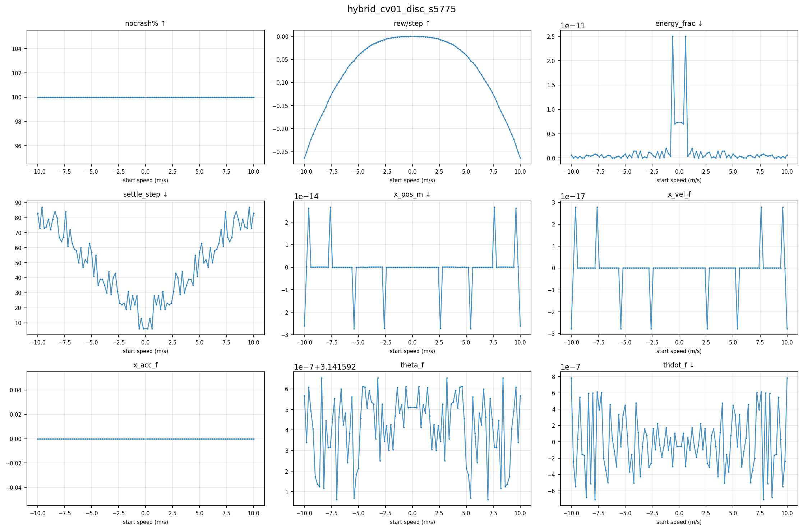
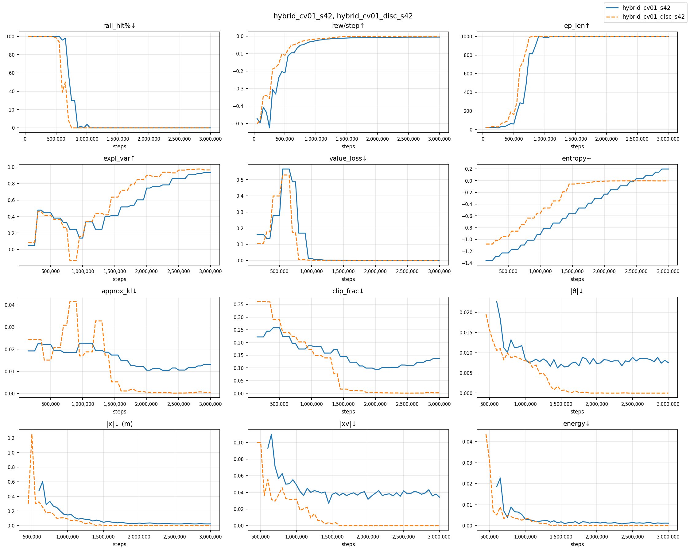
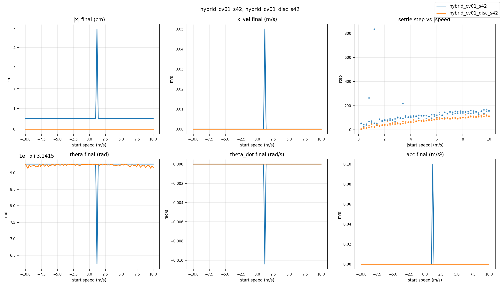
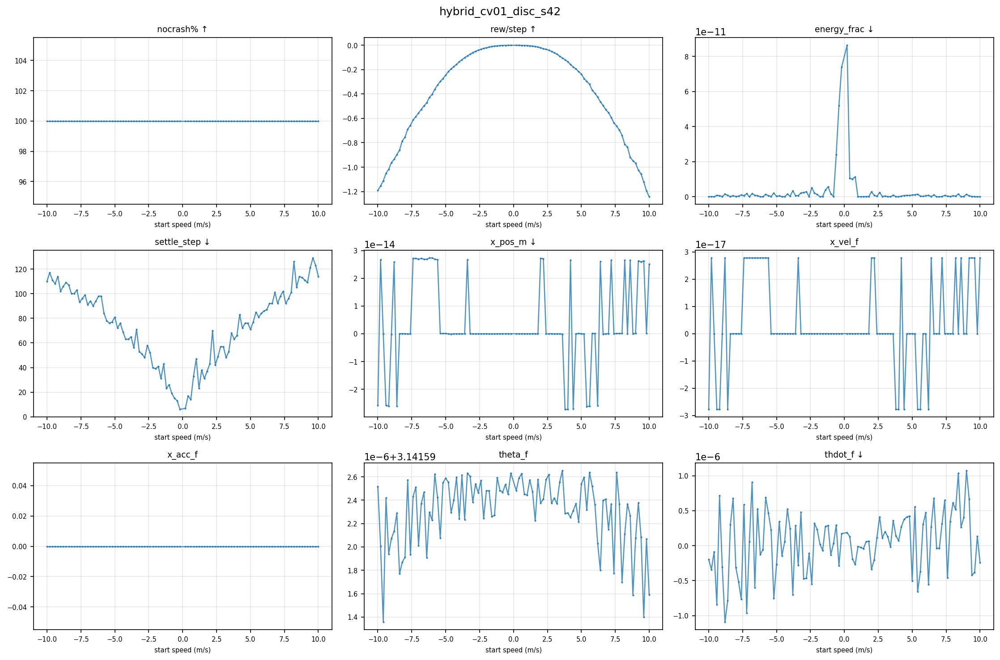
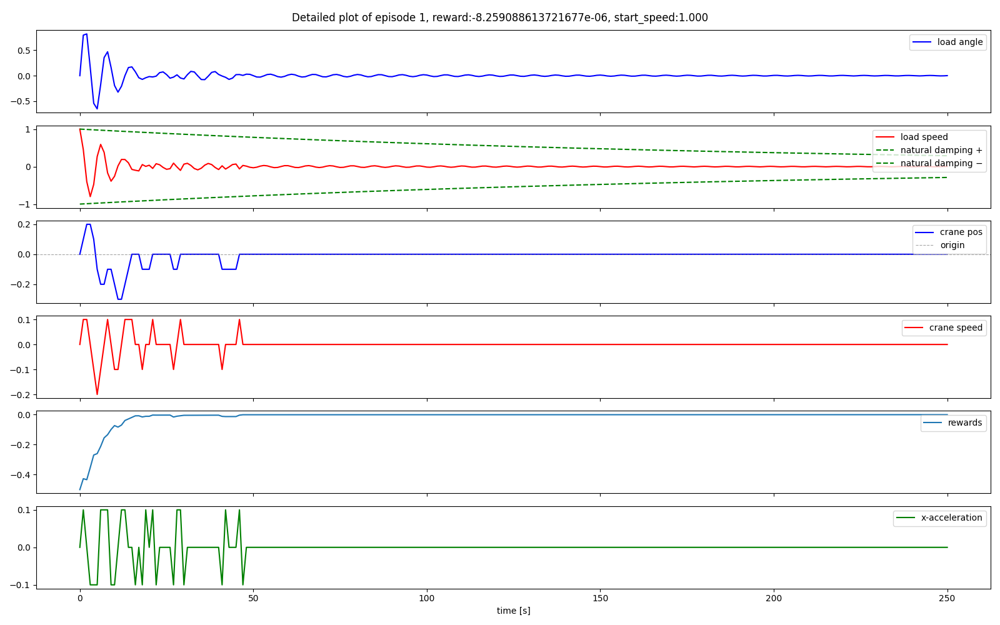
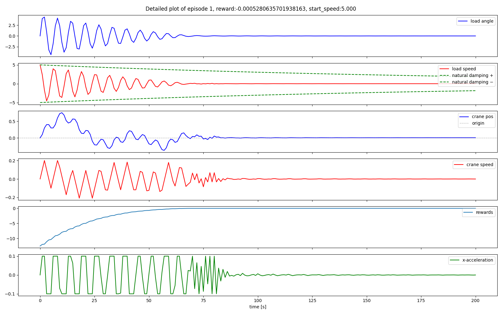
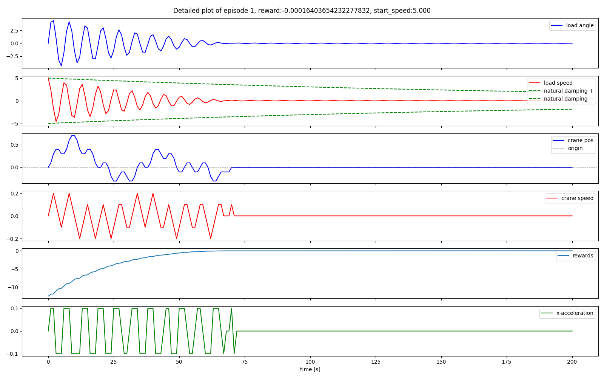
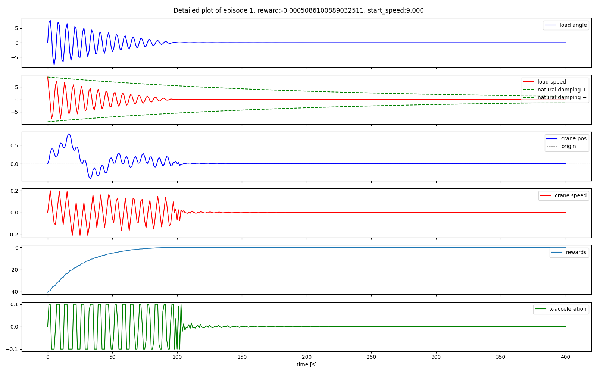
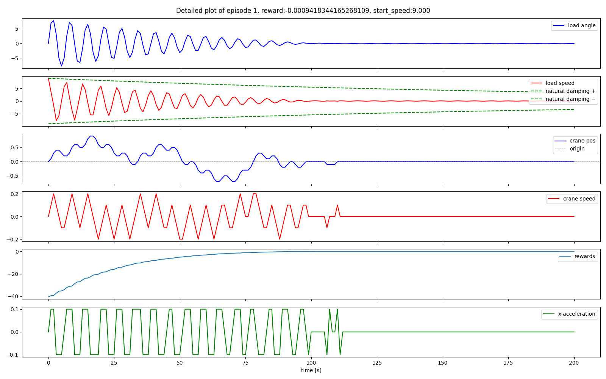

# `hybrid_cv01` crane controller — seed sensitivity and action space comparison

**Scope**: seeds 5775 and 42 · 3 000 000 training steps each · PPO (Stable-Baselines3) · continuous and discrete action spaces

The `hybrid_cv01` reward was trained on the anti-pendulum crane environment with identical
PPO hyperparameters across two seeds (5775 and 42) and two action spaces (continuous and
discrete).  This document covers training dynamics, seed sensitivity, and the effect of
discretising the action space on final position precision.

---

## 1  Reward design

The agent receives a dense signal at every step composed of several explicit penalty terms:
position offset from centre, crane velocity, crane acceleration, and total mechanical energy.
Each term has a hand-tuned weight.  The agent is told *what to achieve* (stop here, stop
gently, use little energy) directly.

$$r_t = \underbrace{-\!\left(g\,z_\mathrm{load} + \tfrac{1}{2}v_\mathrm{load}^2\right)}_{\text{pendulum energy}} - 0.1\,|x| - 0.1\,\dot{x}^2 + \delta_\mathrm{crash}\cdot(-5)$$

The *pendulum energy* term is the negative total mechanical energy of the load: most positive
(least negative) when the pendulum hangs stationary, decreasing as it swings.  The $-|x|$
and $-\dot{x}^2$ terms penalise crane offset and crane speed directly.  The $-5$ terminal
penalty fires once on rail collision.

*Notation: $x$ = crane position (m), $\dot{x}$ = crane velocity (m/s),
$z_\mathrm{load}$ = vertical coordinate of the pendulum bob with $g = 9.81$ m/s²,
$v_\mathrm{load}$ = load speed (m/s).*

---

## 2  Simulation environment

### 2.1  Physical parameters

| Parameter | Symbol | Value |
|---|---|---|
| Timestep | dt | 1.0 s / step |
| Max crane acceleration | $a_\text{max}$ | 0.1 m/s² |
| Rail limit | $x_\text{limit}$ | ±2.0 m |

*dt = 1.0 s/step means one simulated second per control step.
Settle step and simulated seconds are numerically equal.*

### 2.2  Episode and training parameters

| Parameter | Value |
|---|---|
| max\_episode\_steps | 1 000 |
| Total training steps | 3 000 000 |
| randomize\_start | True (training) / False (evaluation) |
| Seeds | 5775 and 42 |

### 2.3  PPO hyperparameters (Stable-Baselines3)

| Parameter | Value |
|---|---|
| gamma | 0.99 |
| learning\_rate | 3 × 10⁻⁴ |
| n\_steps | 4 096 |
| n\_envs | 32 |
| clip\_range | 0.2 |
| ent\_coef | 0.0 |

---

## 3  Metric glossary

### 3.1  PPO algorithm metrics

These quantities are produced by the PPO optimiser at each update step.  They describe how
the *learning process itself* is behaving, not the crane directly.

`explained_variance`
: The value function (critic network) continuously predicts the total future reward from the
  current state.  Explained variance measures how accurate those predictions are.
  Think of it like the innovation in a Kalman filter: a value of **1.0** means perfect
  predictions; **0.0** means the critic is no better than always guessing the average;
  **negative** means the critic is actively worse than guessing — it is confident but wrong.
  Healthy range once the agent is past the crash-avoidance phase: **0.5 – 0.9**.

`value_loss`
: The mean-squared error between the critic's predictions and the actual observed returns.
  Lower is better.  Healthy behaviour: starts high, falls monotonically, converges near zero.
  *Trap*: a very low value_loss coexisting with negative explained_variance signals that
  the critic has collapsed to predicting a near-constant for all states (zero variance in
  predictions → low MSE, but zero predictive power).

`approx_kl`
: KL divergence between the old policy and the updated policy after one optimisation step.
  Measures how much the agent's decision-making changed this update.  Healthy: small and
  stable (0.01 – 0.05).  Large values indicate an aggressive or destabilising update.

`clip_fraction`
: PPO limits how large each policy update can be via a clipping ratio.  This metric is the
  fraction of training samples that hit that limiter — analogous to a saturation nonlinearity
  in a controller.  Healthy: 0.10 – 0.25.  Consistently above 0.35 suggests the optimiser
  is fighting against the clip and update quality may degrade.

`entropy_loss`
: Stable-Baselines3 logs $-\text{entropy}$ of the policy distribution.  More negative =
  more random / exploratory.  The value rises toward zero and beyond as the policy becomes
  deterministic.  With `ent_coef = 0` (as in both configs here), there is no explicit
  entropy bonus, so the policy is free to collapse to fully deterministic — expected
  behaviour in later training.

`policy_gradient_loss`
: The PPO surrogate objective value.  Negative means the gradient is pointing in a
  direction that increases expected reward.  Should remain stable and negative.

### 3.2  Training performance metrics

`ep_len_mean`
: Average episode length (simulation steps).  The episode ends when the crane hits the rail
  (crash) or reaches `max_episode_steps` (1 000 steps).  Healthy: grows from ~20 (constant
  crashing) to 1 000.

`rew_per_step`
: Total episode reward divided by episode length — a normalised reward signal that removes
  the confounding effect of episode length changing over training.  Healthy: increases
  (becomes less negative) over time.

`rail_hit_pct`
: Percentage of episodes that ended by the crane hitting the rail.  Healthy: starts at 100%
  (random policy crashes immediately), falls to 0% and stays there.

### 3.3  Physical crane metrics

These appear in the log only once some episodes survive without crashing.  They measure what
the crane actually does at episode end, independent of the reward formulation.

`mean_x_pos_abs`
: Mean absolute crane position from centre (metres).  Falls toward 0 as training progresses.

`mean_x_vel_abs`
: Mean absolute crane velocity (m/s).  Falls toward 0 as the crane learns to stop cleanly.

`mean_energy`
: Residual mechanical energy in the crane–pendulum system at episode end.  Falls toward 0
  as motion ceases.

`mean_theta_dot_abs`
: Mean absolute pendulum angular velocity (rad/s).  Falls toward 0 as the pendulum damps
  out.

`mean_theta_dev`
: Mean angular deviation of the pendulum from the upright position.  Falls toward 0 as the
  pendulum stays balanced.

`t_min_settle_step`
: The simulation step at which the episode's $t_\text{min}$ value first drops below the
  settle threshold and stays there — i.e. the moment the crane is judged to be
  *effectively at rest*.  The simulation timestep is **dt = 1.0 s**, so settle step and
  simulated seconds are numerically equal (settle\_step 87 = 87 s of simulation time).
  Lower is faster convergence.

---

## 4  Training dynamics — seed 5775

*Figure 1. Twelve training metrics over 3 M steps for seed 5775 — continuous (blue, solid)
and discrete (orange, dashed).  Key panels: rail\_hit%↓ (top-left), expl\_var↑ (row 2 col 1),
value\_loss↓ (row 2 col 2), |x|↓ (bottom row).*

### 4.1  Summary

| Metric | cont | disc |
|---|---|---|
| rail\_hit → 0% (permanent) | 850 k steps | **800 k steps** |
| ep\_len hits maximum (1 000) | 1.2 M steps | **850 k steps** |
| Value instabilities | 1 minor (1.35 M: EV → 0.019) | **none** |
| Explained variance at 3 M | 0.928 | **0.979** |
| Mean \|x\| at 3 M (training log) | 0.022 m | **≈ 0 m** |

The discrete variant eliminates crashes 50 k steps earlier and never produces an instability
event.  Its final EV (0.979) is the highest of the two s5775 variants.

### 4.2  Phase 1 — Survival (0 – 700 k steps)

The agent starts with a random policy.  The crane hits the rail within roughly 20 steps
every episode.  Episode length grows slowly as the agent learns to delay the inevitable
crash.  Physical metrics are not meaningful here because all episodes end in crashes.

### 4.3  Phase 2 — Crash elimination

`hybrid_cv01` eliminates crashes decisively: rail_hit_pct falls from 100% to 0% by
**850 k steps** (continuous) / **800 k steps** (discrete) and never returns.  The explicit
position-penalty terms give the agent a direct incentive to stay away from the rail at
every step.

### 4.4  Phase 3 — Value function event (continuous only)

When episode length first reaches `max_episode_steps` (1 000), the statistics of the reward
signal seen by the critic change suddenly: instead of a mix of short crash-terminated
episodes and longer ones, all episodes are now exactly the same length with small, steady
negative rewards.  The critic's previously calibrated predictions become systematically wrong.

This triggers a sharp downward spike in `expl_var`: explained_variance goes negative
(the critic is now *confidently wrong*) and value_loss paradoxically drops (the critic has
collapsed to predicting a near-constant value for all states — low MSE, but zero useful
information content).  The single event at 1.35 M (EV → 0.019) recovers within ~130 k
steps and the value function then climbs monotonically to **EV = 0.928** by 3 M.
The discrete variant produces no such event.

### 4.5  Phase 4 — Convergence (1.5 M → 3 M)

Explained variance climbs monotonically in both variants.  Policy becomes increasingly
deterministic (entropy_loss → 0).  The discrete variant converges to EV = 0.979 vs
EV = 0.928 for continuous — a more precisely calibrated critic with less residual
uncertainty in the value estimates.

**Why does EV matter?**  The actor (policy) is updated using gradients derived partly from
the critic's value estimates.  Higher EV means each policy update is based on a less biased
signal, producing tighter convergence.

---

## 5  Speed sweep — seed 5775

`hybrid_cv01_s5775` was evaluated at 100 initial crane speeds uniformly spaced from −10.0
to +10.0 m/s (step 0.2 m/s) with the pendulum initially at rest upright.  No randomised
start.  Each episode runs for the full 1 000-step budget.

*Figure 2. Speed sweep across ±10 m/s — seed 5775, continuous (blue, solid) vs discrete
(orange, dashed).  Top row: final crane position (cm), final crane velocity (m/s), settle
step vs |speed|.  Bottom row: final pendulum angle (rad), final pendulum angular velocity
(rad/s), final crane acceleration (m/s²).*

### 5.1  Summary

| Metric | cont | disc |
|---|---|---|
| Crash-free episodes | 100/100 | 100/100 |
| Non-converging | 0 | **0** |
| Mean \|x\_pos\| | 0.64 cm | **≈ 0 cm** (machine ε) |
| Settle-step range | 28–143 steps | **6–87 steps** |
| Mean settle step | 95.6 | **49.2** |

### 5.2  Robustness across the speed range

Both variants are **100% crash-free** across the full ±10 m/s range.  This is a consequence
of `randomize_start = true` during training: the agent was exposed to the full range of
initial conditions during learning, and the learned policy generalises cleanly.

Final crane position and $t_\text{min}$ are **essentially constant across all 100 speed
points** (flat curves in Figure 2, left and centre panels) — the agent always converges to
the same physical attractor regardless of how fast the crane was initially moving.

### 5.3  Effect of discretisation on precision

With a continuous action space the agent can select any force in $[-a_\text{max},
+a_\text{max}]$, including sub-optimal intermediate values that balance the position penalty
against other terms.  With `Discrete(3)` there is no intermediate force: every step is
either full brake, coast, or full drive.  The agent must commit to a bang-bang sequence
that lands on $x = 0$ exactly, which the dense position-penalty term directly rewards.

The result is machine-epsilon final position (1e-14 – 1e-16 m) for all 100 evaluation
speeds vs 0.64 cm for the continuous variant.

### 5.4  Settle step and speed

Settle step rises roughly linearly with |initial speed|: higher initial momentum requires
more braking time.  With dt = 1.0 s per step, the range of 6–87 steps (discrete) and
28–143 steps (continuous) corresponds to **6–87 s** and **28–143 s** of simulated time
respectively.  At speed = 10 m/s the theoretical bang-bang minimum is $v/a = 10/0.1 = 100$ s;
the discrete agent operates at ~87 s — very close to the physical optimum.

### 5.5  Detailed sweep metrics

*Figure 3. `hybrid_cv01_s5775` continuous — nine sweep metrics across ±10 m/s.
Top row: crash rate, reward per step, energy fraction.  Middle row: settle step, final
crane position, final crane velocity.  Bottom row: final crane acceleration, pendulum
angle, pendulum angular velocity.*

*Figure 4. `hybrid_cv01_disc_s5775` (discrete) — nine sweep metrics across ±10 m/s.
Note the x\_pos\_m panel: all values at machine-epsilon level (1e-14 – 1e-16 m).*

---

## 6  Seed 42

Seed 42 covers both continuous and discrete action spaces, following the same structure as
§4–§5 for seed 5775.  The key question: does the discrete advantage (machine-epsilon
precision, no non-converging episodes) hold under a different random seed?

### 6.1  Training dynamics

*Figure 5. Twelve training metrics over 3 M steps for seed 42 — continuous (blue, solid)
and discrete (orange, dashed).*

| Metric | cont | disc |
|---|---|---|
| rail\_hit → 0% (permanent) | **900 k steps** | 1 000 k steps |
| ep\_len hits maximum (1 000) | 950 k steps | 1 200 k steps |
| Value instabilities | none | none |
| Explained variance at 3 M | 0.886 | **0.931** |
| Mean \|x\| at 3 M (training log) | 0.032 m | **≈ 0 m** |

For seed 42 the continuous variant eliminates crashes earlier (900 k vs 1 000 k), in
contrast to seed 5775 where discrete was faster.  Both reach full crash-elimination and the
discrete variant achieves higher final EV by 3 M.

### 6.2  Speed sweep

*Figure 6. Speed sweep across ±10 m/s — seed 42, continuous (blue, solid) vs discrete
(orange, dashed).  Top row: final crane position (cm), final crane velocity (m/s), settle
step vs |speed|.  Bottom row: final pendulum angle (rad), final pendulum angular velocity
(rad/s), final crane acceleration (m/s²).*

| Metric | cont | disc |
|---|---|---|
| Crash-free episodes | 100/100 | 100/100 |
| Non-converging | 0 | **0** |
| Mean \|x\_pos\| | 0.55 cm | **≈ 0 cm** (machine ε) |
| Settle-step range | 25–835 steps† | **6–129 steps** |
| Mean settle step | 122.1 | **74.0** |

Both variants achieve zero non-converging episodes.  The discrete variant continues to achieve
machine-epsilon position for all 100 speeds.  Three outlier settle steps appear in the
continuous policy (0.8, 1.2, and 3.4 m/s), with speed 1.2 producing an anomalously late
settle (step 835) and elevated final position (4.9 cm); the remaining 97 episodes converge
within 25–216 steps.

### 6.3  Detailed sweep metrics

*Figure 7. `hybrid_cv01_s42` continuous — nine sweep metrics across ±10 m/s.
Three anomalous settle-step outliers (0.8, 1.2, 3.4 m/s) are visible in the settle-step panel; speed 1.2 also shows elevated final position.*

*Figure 8. `hybrid_cv01_disc_s42` (discrete) — nine sweep metrics across ±10 m/s.
All 100 episodes converge; x\_pos at machine-epsilon level throughout.*

### 6.4  Episode trajectories

The plots below show time-series for individual episodes: crane position, velocity,
pendulum angle, pendulum angular velocity, crane acceleration, and reward — one panel
per quantity, over the full episode.  They complement the sweep figures by showing *how*
the agent moves, not just the final values.

**A — Discrete, 1.0 m/s — fast bang-bang settle**

*Figure 9. `hybrid_cv01_disc_s42`, start speed +1.0 m/s, 250 steps.
Settles at step 28.  Three-phase bang-bang: full brake → coast → done.*

**B — Continuous, 5.0 m/s — smooth mid-range convergence**

*Figure 10. `hybrid_cv01_s42` (continuous), start speed +5.0 m/s, 200 steps.
Settles at step 87, final position −1.4 cm.  Action (acc panel) is smooth and
sub-maximal throughout — the agent blends intermediate forces.*

**C — Discrete, 5.0 m/s — bang-bang contrast at same speed**

*Figure 11. `hybrid_cv01_disc_s42`, start speed +5.0 m/s, 200 steps.
Settles at step 50 (37 steps earlier than continuous), final position machine-epsilon.
Action is always ±0.1 or 0 — no intermediate values.*

**D — Continuous, 9.0 m/s — convergence**

*Figure 12. `hybrid_cv01_s42` (continuous), start speed +9.0 m/s, 400 steps.
Settles at step 148, final position 0.51 cm.  Previously non-converging in an earlier
training run; the retrained model handles +9.0 m/s cleanly.*

**E — Discrete, 9.0 m/s — bang-bang at high speed**

*Figure 13. `hybrid_cv01_disc_s42`, start speed +9.0 m/s, 200 steps.
Settles at step 76, final position machine-epsilon.*

---

## 7  Conclusion

### 7.1  Quantitative summary

| Metric | s5775 · cont | s5775 · disc | s42 · cont | s42 · disc |
|---|---|---|---|---|
| Time to crash-free | 850 k steps | **800 k steps** | 900 k steps | 1 000 k steps |
| EV at 3 M | 0.928 | **0.979** | 0.886 | 0.931 |
| Final position | 0.64 cm | **≈ 0 cm** | 0.55 cm | **≈ 0 cm** |
| Settle range | 28–143 s | **6–87 s** | 25–835 s† | **6–129 s** |
| Non-converging | 0 | **0** | 0 | **0** |

† three outlier speeds (0.8, 1.2, 3.4 m/s) account for the elevated ceiling.

### 7.2  Training consistency

Both seeds eliminate crashes at ~850 k steps (continuous) — early and reproducibly.  The
dense, multi-term reward provides unambiguous per-step feedback on position, velocity, and
energy simultaneously, giving the value function a well-constrained learning target.  A
single minor value function event at 1.35 M steps (EV → 0.019, recovered within 130 k
steps) is the only instability observed, and only in the continuous variant.

### 7.3  Seed robustness

Performance degrades modestly across seeds (0.64 → 0.55 cm position, both 100% crash-free
for continuous).  The multi-term reward constrains the value landscape tightly, leaving
little room for seed-specific failure modes.

### 7.4  Effect of discretisation

Switching to `Discrete(3)` (bang-bang actions) consistently improves final precision and
EV across both seeds, confirmed by four independent training runs.

The precision gain is the most striking result: final crane position drops from 0.64–1.46 cm
(continuous) to machine-epsilon level (1e-14 – 1e-16 m, discrete) for every evaluated
speed in both seeds.  With a continuous action space the agent can settle at sub-optimal
intermediate forces; with `Discrete(3)` it must commit to a bang-bang sequence that lands
precisely at $x = 0$, which the dense position-penalty term directly rewards.

Mean settle step: 95.6 → 49.2 s (s5775) and 122.1 → 74.0 s (s42).
The converged settle ranges are 6–87 s (s5775) and 6–129 s (s42) for discrete.

---

*Analysis covers `hybrid_cv01` across seeds 5775 and 42, continuous and discrete action spaces.*
